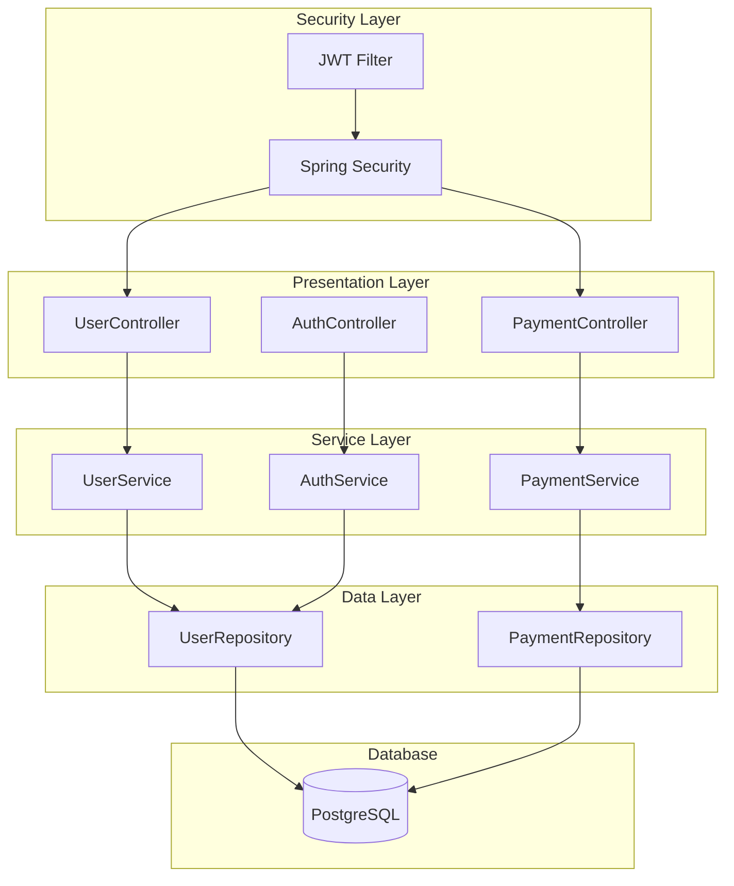
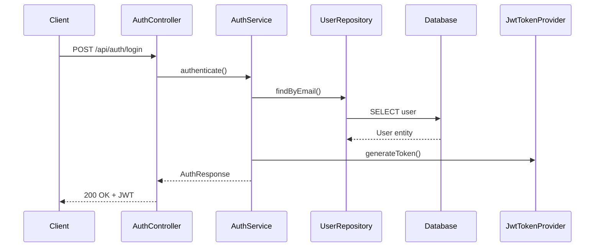
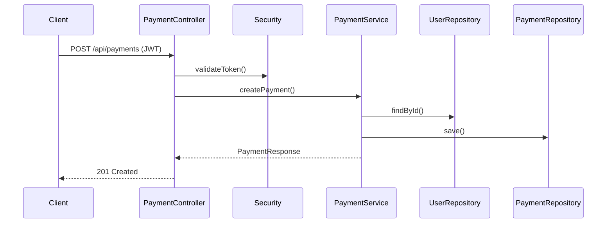
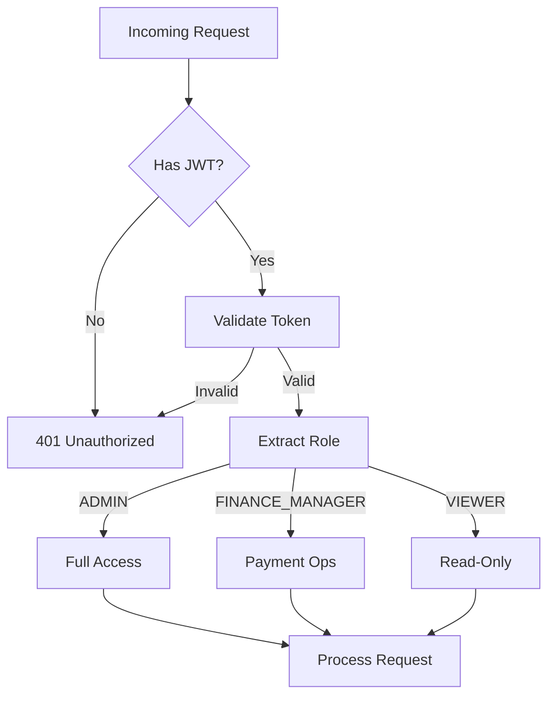
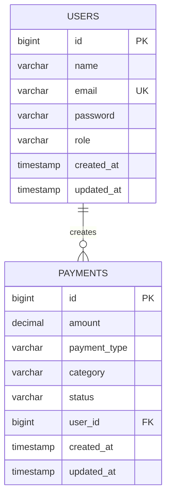

# 💳 Payment Management System

[](https://openjdk.org/projects/jdk/17/)
[](https://spring.io/projects/spring-boot)
[](https://www.postgresql.org/)
[](LICENSE)
[]()
[]()

A robust **Spring Boot**-based payment management system with **role-based access control**, **secure authentication**, and **payment lifecycle management**.

---

## 📑 Table of Contents
- [✨ Features](#-features)
- [🛠 Technology Stack](#-technology-stack)
- [📋 Prerequisites](#-prerequisites)
- [🏗 System Architecture](#-system-architecture)
  - [Class Diagram](#class-diagram)
  - [Component Diagram](#component-diagram)
  - [API Flows](#api-flows)
  - [Database Schema](#database-schema)
- [🚀 Getting Started](#-getting-started)
- [📚 API Documentation](#-api-documentation)
- [🧪 Testing](#-testing)
- [👥 Default Users](#-default-users)
- [🔧 Configuration](#-configuration)
- [📂 Project Structure](#-project-structure)
- [🚀 Deployment](#-deployment)
- [📈 Monitoring & Logging](#-monitoring--logging)
- [🤝 Contributing](#-contributing)
- [📄 License](#-license)

---

## ✨ Features
- **User Management** with **Role-based Access Control (RBAC)**
- **Payment Processing** (Incoming/Outgoing)
- **JWT Token-based Authentication**
- **RESTful API Design**
- **PostgreSQL Integration**
- **Comprehensive Test Coverage** with JaCoCo
- **Input Validation** and **Error Handling**
- **Audit Logging** for payments

---

## 🛠 Technology Stack

| Layer             | Technology |
|-------------------|------------|
| **Backend**       | Spring Boot 3.x, Spring Security, Spring Data JPA |
| **Database**      | PostgreSQL 13+ |
| **Authentication**| JWT (JSON Web Tokens) |
| **Testing**       | JUnit 5, Mockito, TestContainers |
| **Build Tool**    | Maven 3.6+ |
| **Coverage**      | JaCoCo |
| **Docs**          | Swagger/OpenAPI 3 |

---

## 📋 Prerequisites
- Java 17+
- Maven 3.6+
- PostgreSQL 12+
- Git

---

## 🏗 System Architecture

### Class Diagram

```mermaid
classDiagram
    %% Entity Classes
    class User {
        -Long id
        -String name
        -String email
        -String password
        -UserRole role
        +Long getId()
        +String getName()
        +String getEmail()
        +String getPassword()
        +UserRole getRole()
        +Collection<GrantedAuthority> getAuthorities()
        +String getUsername()
        +boolean isAccountNonExpired()
        +boolean isAccountNonLocked()
        +boolean isCredentialsNonExpired()
        +boolean isEnabled()
    }

    class Payment {
        -Long id
        -BigDecimal amount
        -PaymentType paymentType
        -PaymentCategory category
        -PaymentStatus status
        -LocalDateTime date
        -User createdBy
        +Long getId()
        +BigDecimal getAmount()
        +PaymentType getPaymentType()
        +PaymentCategory getCategory()
        +PaymentStatus getStatus()
        +LocalDateTime getDate()
        +User getCreatedBy()
    }

    %% Enum Classes
    class UserRole {
        <<enum>>
        ADMIN
        FINANCE_MANAGER
        VIEWER
    }

    class PaymentType {
        <<enum>>
        INCOMING
        OUTGOING
    }

    class PaymentCategory {
        <<enum>>
        SALARY
        VENDOR
        INVOICE
        INVESTMENT
    }

    class PaymentStatus {
        <<enum>>
        PENDING
        COMPLETED
        FAILED
        CANCELLED
    }

    %% DTO Classes
    class PaymentRequest {
        -BigDecimal amount
        -PaymentType paymentType
        -PaymentCategory category
        -PaymentStatus status
        +getters/setters()
    }

    class PaymentResponse {
        -Long id
        -BigDecimal amount
        -PaymentType paymentType
        -PaymentCategory category
        -PaymentStatus status
        -LocalDateTime date
        -String createdBy
        +getters/setters()
    }

    class UserRequest {
        -String name
        -String email
        -String password
        -UserRole role
        +getters/setters()
    }

    class UserResponse {
        -Long id
        -String name
        -String email
        -UserRole role
        +getters/setters()
    }

    class LoginRequest {
        -String email
        -String password
        +getters/setters()
    }

    class JwtResponse {
        -String token
        -String type
        -String email
        -UserRole role
        +getters/setters()
    }

    %% Controller Classes
    class PaymentController {
        -PaymentService paymentService
        +ResponseEntity<PaymentResponse> createPayment()
        +ResponseEntity<List<PaymentResponse>> getAllPayments()
        +ResponseEntity<PaymentResponse> getPaymentById()
        +ResponseEntity<PaymentResponse> updatePayment()
        +ResponseEntity<Void> deletePayment()
    }

    class AuthController {
        -AuthService authService
        +ResponseEntity<JwtResponse> login()
        +ResponseEntity<UserResponse> register()
    }

    class UserController {
        -UserService userService
        +ResponseEntity<List<UserResponse>> getAllUsers()
        +ResponseEntity<UserResponse> getUserById()
        +ResponseEntity<UserResponse> updateUser()
        +ResponseEntity<Void> deleteUser()
    }

    %% Service Classes
    class PaymentService {
        <<interface>>
        +PaymentResponse createPayment()
        +List<PaymentResponse> getAllPayments()
        +PaymentResponse getPaymentById()
        +PaymentResponse updatePayment()
        +void deletePayment()
    }

    class PaymentServiceImpl {
        -PaymentRepository paymentRepository
        -UserRepository userRepository
        +PaymentResponse createPayment()
        +List<PaymentResponse> getAllPayments()
        +PaymentResponse getPaymentById()
        +PaymentResponse updatePayment()
        +void deletePayment()
    }

    class UserService {
        <<interface>>
        +List<UserResponse> getAllUsers()
        +UserResponse getUserById()
        +UserResponse updateUser()
        +void deleteUser()
    }

    class UserServiceImpl {
        -UserRepository userRepository
        +List<UserResponse> getAllUsers()
        +UserResponse getUserById()
        +UserResponse updateUser()
        +void deleteUser()
    }

    class AuthService {
        <<interface>>
        +JwtResponse login()
        +UserResponse register()
    }

    class AuthServiceImpl {
        -UserRepository userRepository
        -PasswordEncoder passwordEncoder
        -JwtUtils jwtUtils
        +JwtResponse login()
        +UserResponse register()
    }

    %% Repository Classes
    class PaymentRepository {
        <<interface>>
        +List<Payment> findAll()
        +Optional<Payment> findById()
        +Payment save()
        +void deleteById()
        +List<Payment> findByCreatedBy()
    }

    class UserRepository {
        <<interface>>
        +Optional<User> findByEmail()
        +boolean existsByEmail()
        +List<User> findAll()
        +Optional<User> findById()
        +User save()
        +void deleteById()
    }

    %% Security Classes
    class JwtUtils {
        -String jwtSecret
        -int jwtExpirationMs
        +String generateJwtToken()
        +String getUsernameFromJwtToken()
        +boolean validateJwtToken()
    }

    class JwtAuthenticationEntryPoint {
        +void commence()
    }

    class JwtAuthTokenFilter {
        -JwtUtils jwtUtils
        -UserDetailsService userDetailsService
        +void doFilterInternal()
    }

    class SecurityConfig {
        +SecurityFilterChain filterChain()
        +PasswordEncoder passwordEncoder()
        +AuthenticationManager authenticationManager()
    }

    %% Exception Classes
    class ResourceNotFoundException {
        +ResourceNotFoundException()
    }

    class GlobalExceptionHandler {
        +ResponseEntity handleResourceNotFoundException()
        +ResponseEntity handleValidationExceptions()
        +ResponseEntity handleGlobalException()
    }

    %% Main Application Class
    class PaymentManagementSystem {
        +void main()
    }

    %% Relationships
    User -- Payment : creates
    User -- UserRole : has
    Payment -- PaymentType : has
    Payment -- PaymentCategory : has
    Payment -- PaymentStatus : has

    PaymentController --> PaymentService : uses
    UserController --> UserService : uses
    AuthController --> AuthService : uses

    PaymentServiceImpl ..|> PaymentService
    UserServiceImpl ..|> UserService
    AuthServiceImpl ..|> AuthService

    PaymentServiceImpl --> PaymentRepository
    PaymentServiceImpl --> UserRepository
    UserServiceImpl --> UserRepository
    AuthServiceImpl --> UserRepository
    AuthServiceImpl --> JwtUtils

    PaymentRepository --> Payment
    UserRepository --> User

    PaymentController --> PaymentRequest
    PaymentController --> PaymentResponse
    UserController --> UserRequest
    UserController --> UserResponse
    AuthController --> LoginRequest
    AuthController --> JwtResponse

    SecurityConfig --> JwtAuthTokenFilter
    SecurityConfig --> JwtAuthenticationEntryPoint
    JwtAuthTokenFilter --> JwtUtils

```


### Component Diagram

### 🔄 API Flows
## User Authentication


## Payment Creation


### RBAC Flow

### 🗄 Database Schema


### 🚀 Getting Started
## 1️⃣ Clone the Repository
```bash
git clone https://github.com/swarnims_Zeta/PaymentManagementSystemUsingSpringBoot.git
cd PaymentManagementSystemUsingSpringBoot
```

## 2️⃣ Database Setup
```bash
CREATE DATABASE payments_db;
CREATE USER payments_user WITH PASSWORD 'your_password';
GRANT ALL PRIVILEGES ON DATABASE payments_db TO payments_user;
```

## 3️⃣ Configure Environment
```bash
src/main/resources/application-local.properties:

spring.datasource.url=jdbc:postgresql://localhost:5432/payments_db
spring.datasource.username=payments_user
spring.datasource.password=your_password

app.jwt.secret=mySecureJWTKey
app.jwt.expiration=86400000
```

## 4️⃣ Build & Run
```bash
mvn clean install
mvn spring-boot:run
```

## App runs at: http://localhost:8080

### 📚 API Documentation
Swagger File Link :- [Swagger File](https://petstore.swagger.io/?url=https://raw.githubusercontent.com/swarnimsrijan/Mini-Projects/refs/heads/main/PaymentManagementSystemUsingSpringBoot/Swagger.yml)

### 🧪 Testing
```bash
mvn clean test jacoco:report
open target/site/jacoco/index.html
```

